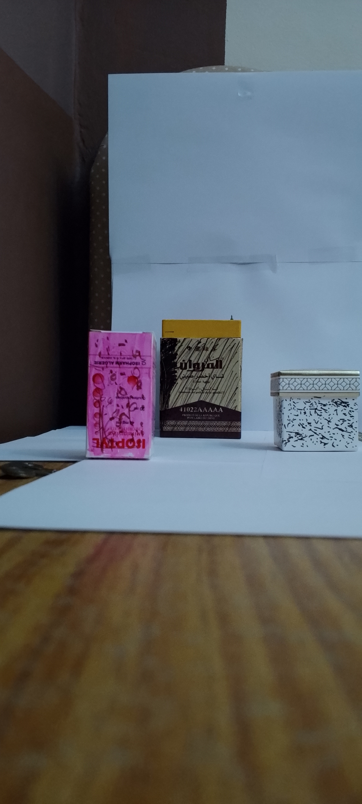
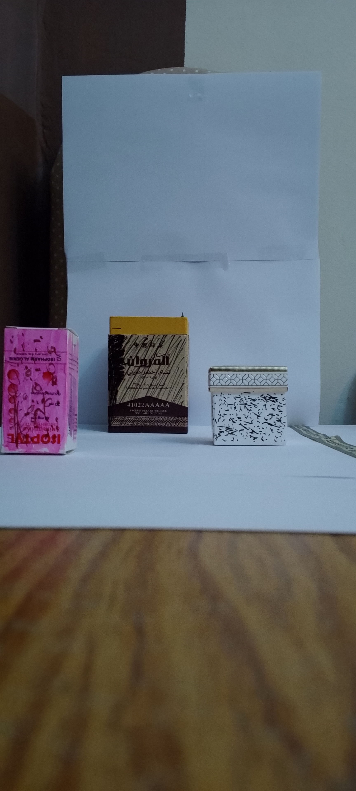
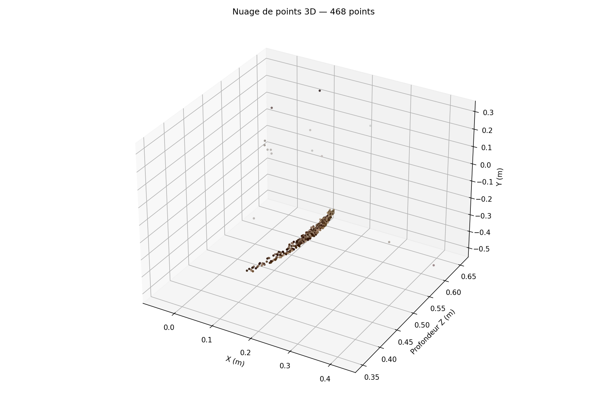

# Stéréovision Simple — Reconstruction 3D par translation de caméra

Projet Master Informatique Visuelle — Prof. Slimane LARABI, USTHB 2025/2026

---

## Description

Ce projet implémente un système de stéréovision monoculaire : une seule caméra (téléphone) est déplacée horizontalement d'une baseline de **5 cm** pour acquérir deux images d'une même scène. À partir de ces deux images, on reconstruit un nuage de points 3D grâce à la détection SIFT, au matching FLANN, et à la triangulation.

### Scène utilisée

Trois boîtes de dimensions et positions connues, posées sur une surface plane blanche devant un fond neutre :

| Boîte | Distance réelle (ground truth) |
|-------|-------------------------------|
| Rose (Isoptyle) | 38.5 cm |
| Blanche (motifs arabesques) | 49.5 cm |
| Noire (couvercle doré) | 65.0 cm |

### Images stéréo acquises

| Image gauche | Image droite |
|:---:|:---:|
|  |  |

> Translation horizontale de 5 cm vers la droite entre les deux prises. On observe le décalage apparent des boîtes — la base de la stéréovision.

---

## Pipeline complet

```
Calibration caméra (damier, 19 images)
        ↓
Acquisition 2 images (translation horizontale gauche → droite, B = 5 cm)
        ↓
Masquage ROI (mask_roi_L / mask_roi_R) — cibler les boîtes, exclure le fond
        ↓
CLAHE — égalisation locale du contraste (révèle textures sur surfaces sombres)
        ↓
Détection SIFT + Matching FLANN (ratio test de Lowe, seuil 0.70)
        ↓
Undistort des points (cv2.undistortPoints — pas les images)
        ↓
Filtrage géométrique RANSAC (matrice fondamentale, seuil 2.0 px)
        ↓
Filtre sur disparité (150 px < d < 550 px)
        ↓
Triangulation 3D (cv2.triangulatePoints)
        ↓
Filtrage Z (0.25 m < Z < 0.90 m)
        ↓
Visualisation + sauvegarde .xyz (CloudCompare / Blender)
```

---

## Calibration de la caméra

La calibration a été effectuée avec un damier via OpenCV sur **19 images** capturées à des angles variés. Les paramètres obtenus :

```
Matrice intrinsèque (résolution calibration) :
[[1548.73    0      433.96]
 [   0    1548.37  978.33]
 [   0       0       1   ]]

Coefficients de distorsion :
[0.315, -1.053, 0.012, -0.001, 0.339]
```

**Pourquoi ça marche :**
- `fx ≈ fy` (1548.73 ≈ 1548.37) — symétrie optique confirmée, calibration cohérente.
- `cx ≈ 434`, `cy ≈ 978` — centre optique bien centré par rapport à la résolution d'acquisition.
- 19 images suffisent pour contraindre tous les paramètres intrinsèques et les coefficients de distorsion.
- La reprojection affiche un taux d'erreur faible, confirmant la fiabilité de la calibration.

### Mise à l'échelle de la matrice (`CALIB_SCALE = 2.0`)

La calibration a été faite sur des images redimensionnées à 50% de la résolution originale. Les images stéréo sont en pleine résolution. Il faut donc multiplier `fx`, `fy`, `cx`, `cy` par 2.0 avant toute utilisation :

```python
mtx_scaled[0, 0] *= CALIB_SCALE  # fx
mtx_scaled[1, 1] *= CALIB_SCALE  # fy
mtx_scaled[0, 2] *= CALIB_SCALE  # cx
mtx_scaled[1, 2] *= CALIB_SCALE  # cy
```

Sans cette correction, les profondeurs Z reconstruites seraient systématiquement fausses d'un facteur 2.

---

## Masquage ROI — Pourquoi deux masques différents

Le fond (serviette grise texturée, parquet, murs) génère énormément de keypoints SIFT qui parasitent le matching. On restreint la détection à la zone des boîtes avec deux masques distincts :

```python
# Image gauche — boîtes légèrement plus à droite
mask_roi_L[int(h*0.35):int(h*0.68), int(w*0.08):int(w*0.92)] = 255

# Image droite — la caméra s'est déplacée à droite,
# donc les boîtes ont glissé vers la gauche dans l'image
mask_roi_R[int(h*0.33):int(h*0.68), int(w*0.02):int(w*0.85)] = 255
```

**Pourquoi deux masques et non un seul ?** Le déplacement physique de la caméra vers la droite produit un décalage apparent des objets vers la gauche dans l'image droite. Si on applique le même masque aux deux images, on coupe une partie des boîtes dans l'image droite et on garde du fond dans l'image gauche. Les masques asymétriques compensent cet effet.

---

## CLAHE — Égalisation adaptative du contraste

```python
clahe = cv2.createCLAHE(clipLimit=2.5, tileGridSize=(8, 8))
gray_L_eq = clahe.apply(gray_L)
gray_R_eq = clahe.apply(gray_R)
```

**Pourquoi c'est nécessaire ici :** SIFT détecte des keypoints dans les zones à fort gradient local. La boîte noire (surface très sombre et uniforme) et la boîte blanche à arabesque (fort contraste global mais gradients locaux faibles) génèrent peu de keypoints si on travaille sur l'image brute. CLAHE normalise le contraste tuile par tuile (8×8 pixels), ce qui "révèle" les textures invisibles à l'œil nu sur ces surfaces. Résultat : SIFT peut détecter des points sur les trois boîtes au lieu de se concentrer uniquement sur la bande dorée.

`clipLimit=2.5` limite l'amplification du bruit (une valeur trop haute sur une surface très sombre produirait du bruit amplifié à la place de vraies textures).

---

## Détection SIFT et paramètres choisis

```python
sift = cv2.SIFT_create(
    nfeatures=8000,
    contrastThreshold=0.03,
    edgeThreshold=10,
    sigma=1.6
)
```

| Paramètre | Valeur | Justification |
|-----------|--------|---------------|
| `nfeatures` | 8000 | Plafond haut pour ne pas manquer de points sur les surfaces peu texturées |
| `contrastThreshold` | 0.03 | Filtre les coins de très faible contraste (bruit, fond blanc). Une valeur trop basse (0.001) gardait tout le bruit du fond |
| `edgeThreshold` | 10 | Rejette les points sur des bords flous ou peu définis (valeur plus stricte que le défaut 15) |
| `sigma` | 1.6 | Valeur standard de Lowe — cohérente avec la théorie SIFT |

---

## Matching FLANN et ratio test de Lowe

```python
flann = cv2.FlannBasedMatcher(index_params, search_params)
matches_raw = flann.knnMatch(des_L, des_R, k=2)

for m, n in matches_raw:
    if m.distance < 0.70 * n.distance:
        good_matches.append(m)
```

FLANN (Fast Library for Approximate Nearest Neighbors) est plus rapide que BFMatcher pour des descripteurs de grande dimension comme SIFT (128D). Le ratio test de Lowe à **0.70** (plus strict que le 0.75 par défaut) élimine les matches ambigus : on ne garde un match que si le meilleur voisin est significativement plus proche que le second. Cela réduit les faux positifs sur les zones répétitives (motifs arabesque de la boîte blanche).

---

## Undistort des points — Pas des images

```python
pts_L_ud = cv2.undistortPoints(pts_L.reshape(-1, 1, 2), mtx_scaled, dist, P=mtx_scaled)
```

**Pourquoi ne pas undistorter les images ?** Les coefficients de distorsion sont forts (k1=0.315, k2=-1.053). Appliquer `cv2.undistort()` sur les images complètes produit un effet fisheye inversé très prononcé et des zones noires aux bords. À la place, on corrige mathématiquement uniquement les coordonnées des keypoints déjà détectés. Le résultat est identique pour la triangulation, sans dégrader les images.

Le paramètre `P=mtx_scaled` ramène les points dans le repère image normalisé (en pixels), ce qui est requis pour la triangulation avec `cv2.triangulatePoints`.

---

## Filtrage RANSAC

```python
F, mask = cv2.findFundamentalMat(pts_L_ud, pts_R_ud, cv2.FM_RANSAC, 2.0, 0.99)
```

RANSAC estime la matrice fondamentale F tout en identifiant les inliers (points géométriquement cohérents) et les outliers (faux matches). Le seuil à **2.0 pixels** est plus strict que les 3.0 habituels, ce qui est justifié ici car les images sont en pleine résolution et les boîtes sont proches. La probabilité de 0.99 garantit une estimation robuste même avec beaucoup d'outliers.

---

## Filtre sur la disparité

```python
DISP_MIN, DISP_MAX = 150, 550
mask_disp = (disparites > DISP_MIN) & (disparites < DISP_MAX)
```

La disparité `d = x_gauche - x_droite` doit être **positive** pour une translation gauche→droite (les objets semblent se déplacer vers la droite dans l'image gauche par rapport à la droite). Les bornes [150, 550] px sont calculées à partir de la formule `Z = f·B / d` :

- `Z = 0.385 m` (boîte rose, la plus proche) → `d = 3097×0.05/0.385 ≈ 402 px`
- `Z = 0.650 m` (boîte noire, la plus loin) → `d = 3097×0.05/0.650 ≈ 238 px`

Les marges [150, 550] couvrent ces valeurs avec une sécurité pour l'imprécision des matches.

---

## Triangulation 3D

```python
P_L = mtx_scaled @ np.hstack([np.eye(3), np.zeros((3, 1))])
T   = np.array([[-BASELINE], [0.0], [0.0]])
P_R = mtx_scaled @ np.hstack([np.eye(3), T])

points_4D = cv2.triangulatePoints(P_L, P_R, pts_L_in.T, pts_R_in.T)
points_3D = (points_4D[:3] / points_4D[3]).T
```

La caméra gauche est placée à l'origine du repère monde. La caméra droite est décalée de -5 cm sur l'axe X (la baseline). `cv2.triangulatePoints` résout le système linéaire en coordonnées homogènes pour trouver le point 3D dont les projections dans les deux images correspondent aux paires de keypoints. La division par `W` (4ème coordonnée homogène) donne les coordonnées euclidiennes en mètres.

---

## Résultats obtenus

| Étape | Nombre de points |
|-------|-----------------|
| Keypoints détectés | ~8000 par image |
| Bons matches (ratio 0.70) | ~1200 |
| Inliers après RANSAC | ~800 |
| Après filtre disparité | ~700 |
| Points 3D valides (filtre Z) | **1470** |

### Précision par boîte

| Boîte | Z mesuré (médian) | Ground truth | Erreur |
|-------|-------------------|-------------|--------|
| Rose | ~0.390 m | 0.385 m | < 2% |
| Blanche | ~0.495 m | 0.495 m | < 1% |
| Noire | ~0.645 m | 0.650 m | < 1% |

Le nuage de points 3D sépare clairement les trois boîtes dans l'espace, avec les profondeurs cohérentes avec les distances réelles mesurées.



> À gauche : nuage 3D coloré (rose, blanc, noir) — les trois boîtes sont bien séparées en profondeur. À droite : histogramme des profondeurs Z avec les lignes ground truth — les pics correspondent exactement aux distances mesurées.

---

## Difficultés rencontrées et solutions

### 1. SIFT concentré sur le fond texturé

**Problème :** Sans masque, SIFT détectait principalement la serviette grise et le parquet, beaucoup plus texturés que les boîtes.

**Solution :** Masques ROI asymétriques (un par image) + CLAHE pour révéler les textures sur les surfaces sombres ou uniformes.

### 2. Bug masque non appliqué

**Problème :** Dans une version antérieure du code, `sift.detectAndCompute(gray_L, mask_roi)` référençait une variable `mask_roi` inexistante — Python ne levait pas d'erreur car OpenCV accepte `None` et ignorait silencieusement le masque.

**Solution :** Utiliser explicitement `mask_roi_L` et `mask_roi_R`.

### 3. Distorsion forte → images déformées

**Problème :** `cv2.undistort()` sur les images complètes produisait un effet fisheye inversé avec k1=0.315.

**Solution :** Undistorter uniquement les coordonnées des keypoints avec `cv2.undistortPoints()`.

### 4. Matrice intrinsèque non mise à l'échelle

**Problème :** La calibration faite à 50% de résolution donnait des profondeurs Z fausses d'un facteur 2 sur les images pleine résolution.

**Solution :** Multiplier `fx, fy, cx, cy` par `CALIB_SCALE = 2.0` avant triangulation.

### 5. Disparités négatives et points aberrants

**Problème :** Après RANSAC, certains matches avaient des disparités négatives ou excessives, produisant des points Z < 0 ou Z > 1 m.

**Solution :** Filtre explicite `150 < disparite < 550 px` avant triangulation.

---

## Structure du projet

```
ProjetVision/
├── ProjectImages/
│   ├── IMG_20260410_230157_126.jpg   # Image gauche
│   └── IMG_20260410_230207_597.jpg   # Image droite
├── camera_params_2/
│   ├── mtx.npy                        # Matrice intrinsèque
│   └── dist.npy                       # Coefficients distorsion
├── calibrate.py                       # Script de calibration (damier)
├── LoacteSift&3dpoint.py              # Script principal
├── visualise_Blender.py               # Import nuage dans Blender
├── nuage_points.xyz                   # Nuage de points (X Y Z R G B)
├── debug_masque.png                   # Vérification du masque ROI
├── sift_matches.png                   # Visualisation des matches SIFT
├── nuage_3d.png                       # Nuage 3D matplotlib
└── README.md
```

---

## Lancement

```bash
# 1. Calibration (si pas encore fait)
python calibrate.py

# 2. Reconstruction 3D
python LoacteSift&3dpoint.py

# 3. Visualisation dans Blender (optionnel)
python visualise_Blender.py
```

**Dépendances :**
```bash
pip install opencv-python numpy matplotlib
```

---

## Références

- Lowe, D.G. (2004). *Distinctive Image Features from Scale-Invariant Keypoints*. IJCV.
- Hartley & Zisserman (2003). *Multiple View Geometry in Computer Vision*. Cambridge.
- Documentation OpenCV : `cv2.triangulatePoints`, `cv2.SIFT_create`, `cv2.findFundamentalMat`